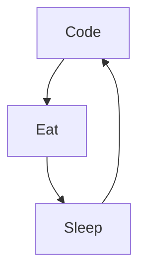

# Hadi Bereksi
I am a French software engineer of 22 years old. Based in Barcelona 🌴, I speak English, Arabic and French fluently. I like to design and build innovative projects and algorithms. As a Golang, C and Django enthusiast, I'm looking for a Software engineering position all around the world or in remote.

<!--
**hadi-ilies/hadi-ilies** is a ✨ _special_ ✨ repository because its `README.md` (this file) appears on your GitHub profile.
-->
Actually:

- 🔭 I’m currently working for Chanel as backend engineer
- 🌱 I’m currently learning amazing things with Azure Cloud services and Python
- 👯 I'm a freelancer
- ⚡ Fun fact : I'm a musician and a boxer
- 📫 How to reach me: Linkedin or email `(hadi-ilies.bereksi-reguig@protonmail.com)`

## My startup

 <strong>
    Asheal
  </strong>
  

    Optimise your medical infrastructure with Asheal
  

  
 
### Connect with me:
  
  

 
 

### Languages and Tools:

 
 

### My daily routine :

