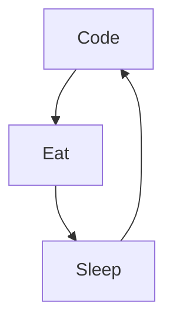

# Hadi Bereksi
Hello! 👋 My name is Hadi, a French software engineer 💻 with a flair for innovation 💡 and a strong foundation in algorithm design. Fluent in English, Arabic, Spanish, and French 🌍, I am a versatile communicator, comfortable in an array of cultural settings. My technical acumen spans a range of programming languages, including Python 🐍, Golang, C/C++. Whether I'm in the vibrant city of Paris 🗼 or the bustling streets of Barcelona 🌇, my enthusiasm for developing groundbreaking software solutions remains unwavering. I'm deeply passionate about harnessing the power of technology to create and bring to life cutting-edge projects 🚀.

<!--
**hadi-ilies/hadi-ilies** is a ✨ _special_ ✨ repository because its `README.md` (this file) appears on your GitHub profile.
-->
Actually:

- 🔭 Working as a backend engineer for Chanel
- 🌱 Creating SAAS with LLMs Azure Cloud services and Python
- 📊 Building a RAG with LLMs, LangChain, fast API and Azure cloud services at Chanel
- 👯 Available for freelance projects (remote only)
- 🎵 Enjoying music and boxing during my spare time

## 🛠️ Some of my Projects

 
 

## Want to Connect?
  

 
 

## 🔨 Languages and Tools:

 
 

### 📊 Github Stats

 
 

## My daily routine :

